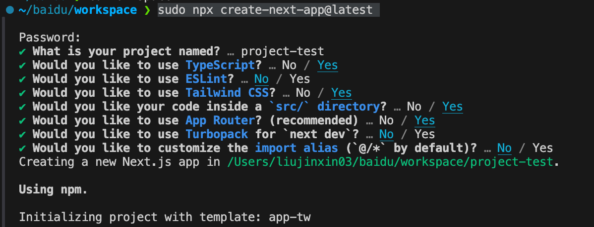
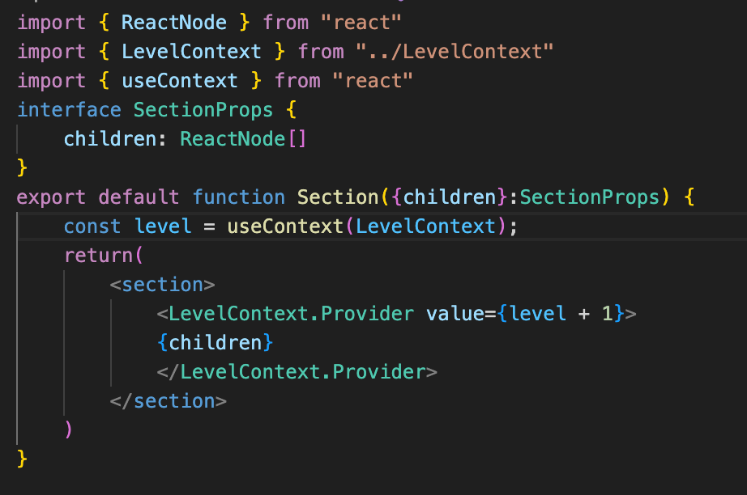

## 其他
### 使用nvm管理node版本
#### nvm下载
`curl -o- https://raw.githubusercontent.com/nvm-sh/nvm/v0.40.2/install.sh | bash`
#### 刷新一下
`source ~/.bashrc`
#### 使用指定的node版本

## react 学习笔记
### 使用
#### 创建一个react项目
创建命令：` npx create-next-app@latest `

### hooks
Hooks ——以 use 开头的函数——只能在组件或自定义 Hook 的最顶层调用。 你不能在条件语句、循环语句或其他嵌套函数内调用 Hook。Hook 是函数，但将它们视为关于组件需求的无条件声明会很有帮助。在组件顶部 “use” React 特性，类似于在文件顶部“导入”模块。
#### useState
- State 是屏幕上组件实例内部的状态。换句话说，如果你渲染同一个组件两次，每个副本都会有完全隔离的 state！改变其中一个不会影响另一个。这就是 state 与声明在模块顶部的普通变量不同的原因。 State 不依赖于特定的函数调用或在代码中的位置，它的作用域“只限于”屏幕上的某块特定区域。
- 不要在 state 中镜像 props, 
```
function Message({ messageColor }) {
  const [color, setColor] = useState(messageColor);
}
```
这里，一个 color state 变量被初始化为 messageColor 的 prop 值。这段代码的问题在于，如果父组件稍后传递不同的 messageColor 值（例如，将其从 'blue' 更改为 'red'），则 color state 变量将不会更新！ state 仅在第一次渲染期间初始化。
#### useReduce
##### 用法：
useReducer是一个Hook，它接收一个reducer函数和一个初始状态action，返回一个数组，其中包含当前状态和一个dispatch函数。reducer函数是一个函数，它接收当前状态和一个表示将要执行的动作的对象，返回一个新的状态对象。 
useReducer 通常比 useState 更适合用于复杂 state 逻辑的情况。例如值类型需要多个子值，或者下一个 state 依赖于之前的 state。
##### 语法结构：
```
const [state, dispatch] = useReducer(reducer, initialState);
```
其中，  
1. reducer: 接收两个参数，当前状态和动作，返回新的状态。
```
function reducer(state, action) {
  switch (action.type) {
    case 'increment':
      return { count: state.count + 1 };
    case 'decrement':
      return { count: state.count - 1 };
    default:
      return state;
  }
}
```   
参数 state：当前状态  
参数 action：一个描述要做什么的对象，通常有 .type 字段  
返回值：更新后的新状态对象（⚠️ 不应直接修改原状态）

2. initialState  
第一次渲染时的状态，比如：
```
const initialState = { count: 0 };
```
3. [state, dispatch]  
这是 useReducer 返回的两个值：  
state: 当前状态值  
dispatch: 用于触发状态更新的函数，接收一个 action 对象作为参数


##### 与useState比较
- useState  （datas, setDatas） 
    ```
        function add() {
            setDatas(增加操作)
        }
        function change() {
            setDatas(修改操作)
        }
        function delete() {
            setDatas(删除操作)
        }
        function search() {
            setDatas(查找操作)
        }
    ```
- useReducer中的reducer
    ```
        function reducer(tasks, action) {
        switch (action.type) {
            case 'added': {
            return [
                ...tasks,
                {
                id: action.id,
                text: action.text,
                done: false,
                },
            ];
            }
            case 'changed': {
            return tasks.map((t) => {
                if (t.id === action.task.id) {
                return action.task;
                } else {
                return t;
                }
            });
            }
            case 'deleted': {
            return tasks.filter((t) => t.id !== action.id);
            }
            default: {
            throw Error('未知 action: ' + action.type);
            }
        }
        }
    ```
| 特性       | `useReducer`   | `useRef`            |
| -------- | -------------- | ------------------- |
| 类型       | 状态管理 Hook      | 引用管理 Hook           |
| 更新是否引起渲染 |  是            | 否                 |
| 适合场景     | 管理复杂 state     | 引用 DOM、保存不触发更新的值    |
| 数据存储位置   | React state    | `.current` 属性       |
| 替代对象     | `useState` 的增强 | class 中的 `this.ref` |

#### useContext
context 让你可以从上层的组件读取信息，每个 Section 都会从上层的 Section 读取 level，并自动向下层传递 level + 1

Context 使组件向其下方的整个树提供信息。
传递 Context 的方法:
通过 export const MyContext = createContext(defaultValue) 创建并导出 context。
在无论层级多深的任何子组件中，把 context 传递给 useContext(MyContext) Hook 来读取它。
在父组件中把 children 包在 <MyContext.Provider value={...}> 中来提供 context。
Context 会穿过中间的任何组件。
Context 可以让你写出 “较为通用” 的组件。
另一个例子：
```
import { createContext, useContext, useState } from 'react';

// Step1 创建Context（带默认值）
const ThemeContext = createContext('light');

function App() {
  // Step3 提供context值
  const [theme, setTheme] = useState('light');
  
  return (
    <ThemeContext.Provider value={theme}>
      <Toolbar />
      <button onClick={() => setTheme(theme === 'light' ? 'dark' : 'light')}>
        切换主题
      </button>
    </ThemeContext.Provider>
  );
}

function Toolbar() {
  // 中间组件不需要透传props
  return <ThemedButton />;
}

function ThemedButton() {
  // Step2 使用context
  const theme = useContext(ThemeContext);
  return (
    <button style={{ 
      background: theme === 'dark' ? '#333' : '#EEE',
      color: theme === 'dark' ? 'white' : 'black'
    }}>
      当前主题: {theme}
    </button>
  );
}
```
#### useRef
useRef 是 React 提供的一个 Hook，主要用于：  
- 访问 DOM 元素（例如获取一个 input 元素的值）  
- 保存一个可变的值而不触发重新渲染  
基本语法
```
const myRef = useRef(initialValue);
```

#### useCallBack
useCallback 是 React 提供的一个 Hook，用于缓存函数引用，从而避免不必要的函数重新创建，常用于 性能优化。
```
const memoizedCallback = useCallback(() => {
  // 函数逻辑
}, [依赖项]);
```
- 如果 依赖项 没变，React 会返回上一次的函数引用。
- 如果 依赖项 变化了，React 会重新创建该函数。

### ahooks
#### useLatest
test
### 其他
- 每个包含 JSX 的文件都必须使用 .tsx 文件扩展名。这是一个 TypeScript 特定的扩展，告诉 TypeScript 该文件包含 JSX。
- 组件的css样式通常通过`import styles from "./styles.module.css"` 用法引入使用。这种用法是 CSS Modules 的标准特性，其原理和用法如下：
CSS Modules 通过构建工具（如 Webpack 或 Vite）处理 .module.css 文件时，会自动将文件中的所有类名转换为局部作用域的唯一哈希值，并生成一个默认导出的 JavaScript 对象（即 styles）。这个对象包含映射关系，例如：
    ```
    /* styles.module.css */
    .title { color: red; }
    ```
    会被转换为类似：
    ```
    { title: "styles_title_abc123" } // 自动导出为 `styles` 对象
    ```
    因此无需手动声明或导出 styles，构建工具会隐式完成这一过程。
- type
    可声明联合类型（如string | null）、元组、基本类型别名（如type Name = string）12
    支持typeof、keyof、in等操作符动态生成类型12
    TypeScript
    type SquareValue = string | null; // 联合类型
- interface
    主要用于描述对象结构，无法直接声明联合类型（需通过属性定义间接实现）12
    支持声明合并（同名接口会自动合并）12
    TypeScript
    interface SquareProps {
    value: string | null; // 属性值为联合类型
    }
- 调用onclick方法时，最好用箭头函数将函数包裹一下，因为直接调用函数会在渲染时立即执行，
箭头函数或.bind会创建一个新函数，在点击时才执行。
```
<button onClick={()=>jumpToMove(move)}>{discription}</button>
```
### errors
1. 访问某个数组索引时，总是报错显示代码中该数组是undefind。但是vscode未报错，连warnning都没有。试图调试，但是结果总是打印不出来。各种调试，都是不成功。实在没办法了，去问各种大模型，结果都找不出错误。
resolve：询问同事后才知道，next框架有一个特性，在浏览器运行前会在服务端跑一遍，所以在浏览器打印结果是没有用的。所以要在文件顶上加上`use client`, use client‌ 指令告诉 Next.js 这个组件应该在客户端渲染，因为它使用了 React 的状态和事件处理程序‌。
